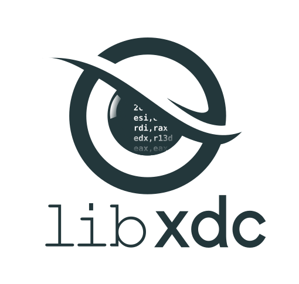

# libxdc

<p>

</p>

libxdc (e**X**tremely fast **D**e**C**oder) aims to be the best Intel-PT decoding library for fuzzing purposes. It was designed to power various of our binary-only fuzzers such as [kAFL](https://github.com/RUB-SysSec/kAFL), [Redqueen](https://github.com/RUB-SysSec/redqueen), [Grimoire](https://github.com/RUB-SysSec/grimoire) and Nyx. We heavily optimized the library towards decoding similar traces over and over again. In contrast to other options with similar goals, we decode the full information to yield precise coverage information. Thanks to the magic of computed gotos, struct of arrays, heavy caching, branchless code and tons of unreasonable micro optimizations, it is by far the fastest Intel-PT decoder we found.

## Usage

Using libxdc is rather simple:

```c
page_cache_t* page_cache =  page_cache_new(page_cache_file);
void* bitmap = malloc(0x10000);
libxdc_t* decoder = libxdc_init(filter, &page_cache_fetch, page_cache, bitmap, 0x10000);
ret = libxdc_decode(decoder, trace, trace_size);
```

To create a a decoder you use `libxdc_t* libxdc_init(uint64_t filter[4][2], void* (*page_cache_fetch_fptr)(void*, uint64_t, bool*), void* page_cache_fetch_opaque, void* bitmap_ptr, size_t bitmap_size)`. This function takes a set of 4 `filter` ranges as you configured them during tracing. To disassemble the target, a callback `page_cache_fetch_fptr`has to be provided that  allows libxdc to request memory. To help with this task, a opaque `void*` can be passed to `libxdc_init` that will be passed to this callback. In our fuzzers we use this callback to access the targets memory. This can also be used to deal with dynamically generated code such as manually loaded libraries, swapped out pages  or unpackers. If the callback requests a page  that is not currently available in our memory snapshot, we place a hardware breakpoint on the address that was requested for disassembly. Then  we perform a second execution without tracing, dumping the page to the cache when the instruction is executed. 

 Lastly, a pointer to the bitmap and it's size needs to be provided. After we obtained a decoder object, we can use `libxdc_decode` to decode a trace. The bitmap will be filled according to the trace by the decoder. Between individual test cases, the callee is responsible for resetting the bitmap to 0 after each test case.

To obtain more information on the decoding process you can register additional callbacks:

You can register a callback that is triggered for each new basic block found (`libxdc_register_bb_callback`). This can be used to perform more in depth analysis of the code that is being executed. 

By adding an edge callback (`libxdc_register_edge_callback`) and enabling trace mode (`libxdc_enable_tracing`) you can perform a decoding where each edge taken is passed back to you for inspection. Manually enabling/disabling the trace mode is necessary,  since in contrast to the basic block callback this  slows down the decoding process.

#### Warnings:

You need to set at least one of the filter ranges. They need to be set to the same values used during the intel-pt tracing. If you do not configure the right ranges you will see an assertion `count_tnt(self->tnt_cache_state) != 0`.

You need to append a single byte 0x55 to the trace, but excluded it from the trace size. This byte is used to mark the end of the input and allows us to increase the performance during decoding. If you do not do this, an assertion is raised.

This decoder expects that return compression and generation of CYC, TSC and MTC packets are disabled.
You can disable those options if you are using perf. KVM-PT disables them by default. To manually disable return compression set bit 11 (`DisRETC`) in `IA32_RTIT_CTL` MSR to 1. CYC, MTC and TSC packet generation can be disabled if bit 1 (`CYCEn`), bit 9 (`MTCEn`) and bit 10 (`TSCEn`) are set to 0. 

## Performance Evaluation

Extraordinary claims require extraordinary evidence. As such, we of course perform a set of entirely unfair and unscientific experiments to substantiate our performance claims. To check the decoding/disassembly performance of various available options for dealing with Intel PT data we setup an experiment in which we picked about a GB of traces from fuzzing various targets. We extracted various alternative approaches from other fuzzers such as WinAFL, Honggfuzz, PTrix and Killerbeez to create a controlled evaluation setup. Most of these tools only consider a subset of the data for performance reasons. It should be noted that some of these tools claim performance improvements over full decoders such as our approach used in kAFL. Notably, PTrix evaluated against various alternatives, but measured only a single execution on cold caches. As we shall see, while these tools provide data that is far less useful for fuzzing, they do not actually provide performance advantages. 

We compare five alternatives to libxdc: 

* libipt, the original decoding library provided by Intel. libipt can fully decoding all information available in Intel-PT data streams.  

* WinAFL-libipt, a version of libipt with an additional caching layer introduced by Ivan Fratric for use during fuzzing in WinAFL. Like libipt, this approach is decoding full edge coverage.

* PTrix, to increase performance, the authors of PTrix chose not to recover full edge coverage. Instead, individual runs of taken/not taken decisions are hashed together. This way, PTrix avoids to disassemble the target, but it will result in significantly noisier coverage. 

* Hongfuzz: Similarly to PTrix, honggfuzz avoids disassembling the stream and instead only considers the contend of the TIP packages.  It should be noted that it seems like the authors ignored TIP compression and hence cause a significant amount of collisions in the bitmap.

* The last option, a Intel PT "decoder" used by Killerbeez takes this idea even further: All of the data is simply hashed in two distinct large streams. Any change to the path taken, no matter how small will result in a completely different hash. We have strong reason to suspect that this approach is almost useless for fuzzing, as it will generate a very large number of useless queue entries. However, for the sake of completeness, we are including it in our comparison.

We should mention that we did not compare against [PTFuzz](https://github.com/hunter-ht-2018/ptfuzzer/blob/master/pt/disassembler.h), as the authors used the outdated kAFL code base that libxdc is also based on. As an amusing Sidenote: the authors of PTFuzz chose to not mention this fact in the paper, instead claiming that they developed their own decoder. 

We used these libraries to decode a few thousand iterations of Intel-PT data resulting from fuzzing some random targets that we used for debugging purposes and measured the time used.

As you can see in this entirely unscientific benchmark, libxdc is about 15x-30x faster than libipt and quite a bit faster than all other options that are returning a coverage bitmap. Only the last option (Killerbeez) manages to perform similar, while producing vastly less useful results. 

The bars show the average slowdown over the best decoder. The error bars represent the best and the worst performance across 3 runs (each decoding a few thousand traces). The experiment setup and data can be found [here](https://github.com/nyx-fuzz/libxdc_experiments) 


### Honeybee

In 2021, Trail of Bits released [Honeybee](https://github.com/trailofbits/Honeybee), a fuzzer that builds on top of libxdc by merging it into honggfuzz. They also proposed to create the decoder caches in a preprocessing step. Initially we were very enthusiastic about this approach, as any improvement to libxdc would be a significant win for fuzzing and the idea of statically constructed highly cpu-cache friendly caches is pretty cool. We immediately started evaluating Trail of Bits' version of libxdc. It turned out that the experiments performed were not measuring what we care about: Performance on a single execution instead of performance on thousands of executions (as occur within the typical fuzzing campaign). We repeated the experiments in a setup that compares both decoders 4 times (in each case decoding the same trace 25 times in a row) similar to how we meassured all other decoders before. To our surprise we found that on average libxdc is in fact around 1.5x faster than Honeybee's decoder. On the other hand, when running a single input on cold caches of libxdc, we find that Honeybee outperformes libxdc in many cases. It should be noted, we didn't include Honeybee's additional overhead for creating the caches as those would be neglectable during fuzzing. The resulting plots can be found [here](https://github.com/nyx-fuzz/libxdc_experiments/raw/master/experiments/eval_honeybee_cold.png).

Together with the author of Honeybee, we investigated the reasons for this surprising performance result, and found that Honeybee uses a different kind of caching than libxdc. In libxdc, the decoder caches pairs of addresses (up to the next 56 Taken/NotTaken-bits) and maps those to bitmap deltas. That is, with a single cache lookup, libxdc is able to handle up to 56 edges at once. This wouldn't be feasible with static caches as the number of such entries is too large to be exhaustively enumerated. Additionally, Honeybee choose to use branching versions for some highly performance critical functions, whereas libxdc uses these only in debug builds and runs optimized branch-free code in the release build.

The results of our experiments are presented below. It should be noted that we only evaluate on the examples provided by Honyebee. This is due to the fact that the pre-processing stage of Honeybee is limited to analyzing a single ELF executable with a single executable section, whereas many of our experiments use memory dumps with libraries and kernel modules mapped into the process address space.


## Install

libxdc depends on capstone v4. Unfortunately, many distributions don't contain this version in their package management. To install libcapstone v4: 

```bash
git clone https://github.com/aquynh/capstone.git
cd capstone
git checkout v4
make 
sudo make install
```

If libcapstone v4 is installed, you can install libxdc:

```bash
git clone https://github.com/nyx-fuzz/libxdc.git
cd libxdc
make install
```

This builds both a .so and a static .a version of the library. For performance reasons we recommend to use the static version IF you are able to use link time optimizations during the compilation of your tool. 

## Bug Reports and Contributions

Should you find a bug in libxdc's decoding and need help fixing it, please make sure that the report includes the target memory dump and the trace dump.  If you found and fixed a bug on your own: We are very open to patches, please create a pull request!  

### License

The library is provided under **MIT license**. 

**Free Software Hell Yeah!** 

Proudly provided by: 
* [Sergej Schumilo](http://schumilo.de) - sergej@schumilo.de / [@ms_s3c](https://twitter.com/ms_s3c)
* [Cornelius Aschermann](https://hexgolems.com) - cornelius@hexgolems.com / [@is_eqv](https://twitter.com/is_eqv)
